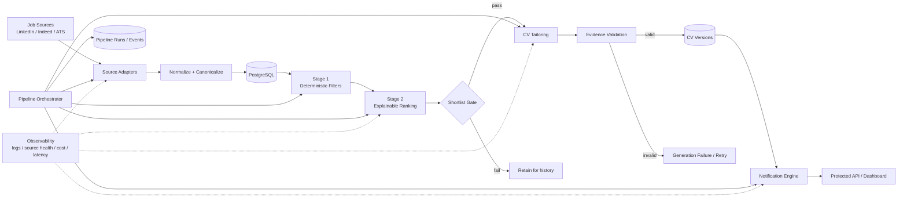
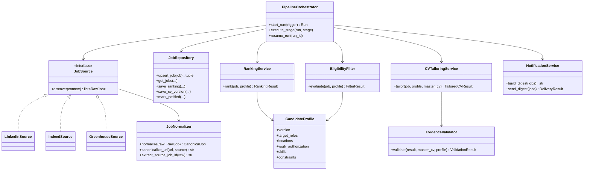
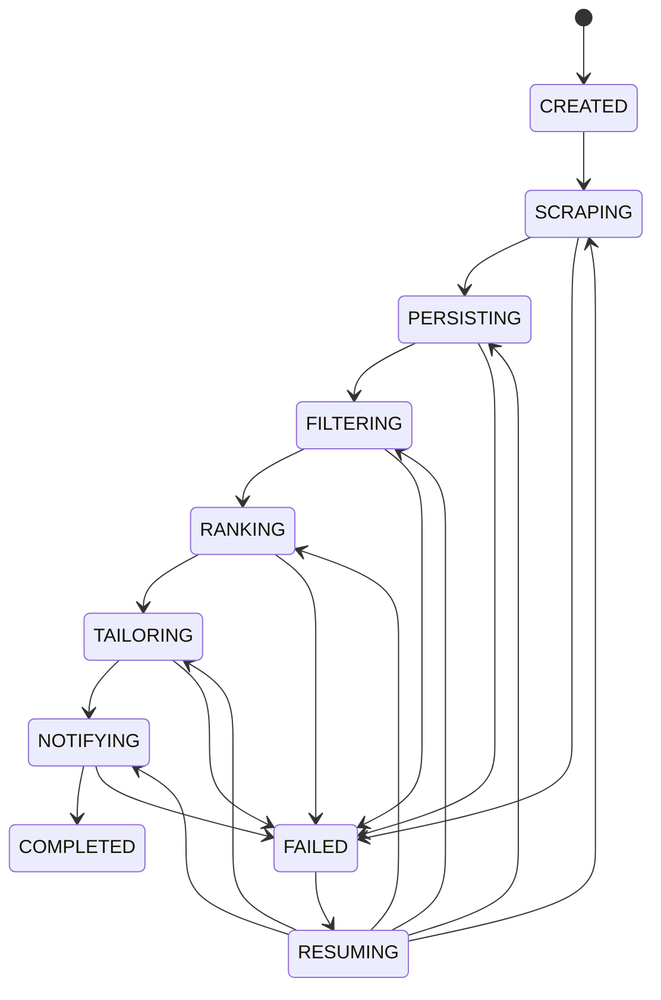

# Phase 2 Architecture — Trusted Job Intelligence Core

## Objective

Phase 2 turns the Phase 1 prototype into a reliable, observable, secure job-intelligence pipeline without introducing unnecessary product/UI complexity.

The architectural goals are:

1. make every pipeline run traceable and restartable;
2. establish stable job identity and idempotent ingestion;
3. separate eligibility/ranking from expensive CV generation;
4. make ranking explainable and measurable;
5. make CV generation structured, evidence-constrained, and auditable;
6. prevent duplicate notifications and overlapping pipeline runs;
7. protect mutation and pipeline-trigger boundaries;
8. establish CI, regression tests, and eval harnesses before V2 feature work.

## System Flow



## Component Model



## Pipeline State Machine



A run records its last completed stage. Resumption must not repeat work that has already been committed successfully.

## Core Data Contracts

### RawJob

Source-specific discovery output.

- title
- company
- location
- url
- description
- source
- source_job_id when available
- discovered_at
- source_payload metadata when useful

### CanonicalJob

Normalized internal representation.

- source
- source_job_id
- canonical_url
- title
- company
- normalized_company
- location
- description
- content_hash

Preferred identity constraint:

```text
UNIQUE(source, source_job_id)
```

For sources without a stable native ID, a deterministic fallback identity may be derived from canonical URL plus source.

### RankingResult

- total_score: 0..100
- hard_mismatch: bool
- component_scores
- explanation
- ranking_model / prompt version
- candidate_profile_version

### TailoredCVResult

- tailored_cv
- changes_made
- evidence_used
- keywords_added
- warnings
- model
- prompt_version

The generation is not considered valid until evidence validation succeeds.

## Source Adapter Rule

Browser scraping is a fallback, not the default integration strategy.

Preferred hierarchy:

1. official/public ATS endpoint or feed;
2. company careers endpoint;
3. structured aggregator endpoint;
4. DOM/browser scraping where necessary.

Every adapter emits the same RawJob contract and reports source-health metrics.

## Candidate Profile

Matching preferences must not be duplicated across hard-coded prompts.

The candidate profile is the source of truth for matching constraints and preferences. The master CV is the source of truth for claims that may appear in generated application documents.

## Ranking Architecture

Stage 1 applies deterministic rules such as location, role family, obvious seniority mismatches, work-authorization constraints, excluded companies, and other configured hard rules.

Stage 2 produces semantic fit only for candidates that survive Stage 1.

CV generation happens only after a shortlist threshold is met.

## Reliability Rules

- only one active pipeline run at a time;
- stages are idempotent;
- retries use bounded backoff;
- external-service failures are explicit, not silently swallowed;
- each run records counts, durations, errors, and external-call cost metadata;
- duplicate delivery is prevented through persisted notification state.

## Out of Scope for Phase 2

- automatic application submission;
- large-scale cover-letter generation;
- LinkedIn outreach/network automation;
- multi-user SaaS;
- billing/subscriptions;
- mobile application;
- frontend rewrite;
- conversational UI.
