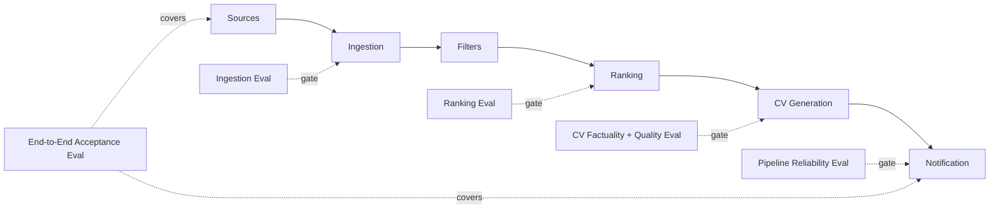

# Phase 2 Evaluation Harnesses

## Principle

Unit tests verify that code behaves as implemented. Evaluation harnesses verify that the agent's decisions and generated outputs are good enough.

Phase 2 treats evals as product infrastructure rather than a release-time afterthought.

## Quality Gates



## 1. Ingestion Evaluation Harness

Purpose: detect source-parser regressions, identity errors, and silent data degradation.

Checks:

- source adapter output conforms to RawJob contract;
- native source ID is preserved when available;
- canonical URL retains identity-bearing parameters;
- tracking-only parameters are removed;
- required fields are non-empty;
- duplicate records collapse correctly;
- representative source fixtures still parse;
- abnormal zero-result or description-failure rates are visible.

Initial critical regression case:

```text
https://ca.indeed.com/viewjob?jk=ABC123
https://ca.indeed.com/viewjob?jk=XYZ789
```

These must remain distinct after canonicalization.

## 2. Ranking Evaluation Harness

Purpose: measure whether the system recommends the right jobs in the right order.

Dataset:

- strong matches;
- legitimate borderline matches;
- obvious poor matches;
- deliberately confusing negatives.

Initial dataset starts small and expands toward 50–100 labelled jobs.

Metrics:

- Precision@K;
- Recall for labelled strong matches;
- strong-vs-weak pairwise accuracy;
- large rank-shift detection between versions;
- hard-mismatch false-positive rate;
- score distribution stability.

A ranking change fails evaluation when an obviously irrelevant job outranks strongly relevant jobs without an explainable configured reason.

### Candidate vs production comparison

Every prompt/model/scoring change should compare current and candidate versions on the same golden set.

Recommended report:

```text
Metric                     Current     Candidate
Precision@10               0.80        0.90
Pairwise accuracy          0.91        0.95
Hard-mismatch FP rate      0.02        0.01
Mean ranking cost/job      ...         ...
P95 ranking latency        ...         ...
```

## 3. CV Factuality / Evidence Harness

Purpose: prevent fabricated or unsupported claims.

Every material generated claim must be traceable to one or more evidence items from the master CV or structured candidate profile.

Primary metric:

```text
evidence_coverage = supported_material_claims / total_material_claims
```

Target for persisted CVs: 100% material-claim evidence coverage.

Failures block the CV from being marked ready.

Examples of blocking failures:

- invented employer;
- invented metric;
- inflated scope;
- unsupported certification;
- unsupported technology claimed as prior experience;
- materially altered dates.

## 4. CV Quality Harness

Purpose: ensure tailoring improves relevance without degrading factual integrity or readability.

Checks:

- required output schema;
- required CV sections preserved;
- role-relevant terminology is reflected naturally;
- keyword stuffing is limited;
- materially relevant experience is promoted;
- unsupported sections are not deleted;
- excessive CV growth/shrinkage is detected;
- model output contains no control text or prompt leakage.

Factuality is a hard gate. Style/relevance metrics may initially be advisory until calibrated.

## 5. Pipeline Reliability Harness

Purpose: prove that the system fails safely and resumes correctly.

Fault-injection cases:

- source timeout;
- database failure after scraping;
- ranking provider timeout;
- CV provider malformed response;
- email send failure;
- manual trigger while scheduled run is active.

Assertions:

- run enters FAILED with correct failed stage;
- committed prior-stage work remains intact;
- retry/resume starts from a safe stage;
- completed jobs are not duplicated;
- duplicate CV generation is avoided when possible;
- notifications with a committed delivery record are not sent twice;
- external-send success before a database commit remains an explicit ambiguous case;
- lock prevents concurrent runs.

## 6. API / Security Harness

Checks:

- unauthenticated mutation requests fail;
- unauthenticated pipeline trigger fails;
- malformed UUIDs produce 4xx, not 500;
- untrusted HTML is escaped;
- unsafe link schemes are rejected;
- CORS policy is restrictive;
- repeated pipeline triggers cannot create overlapping work;
- secrets are never returned by API endpoints or logs.

## 7. End-to-End Acceptance Harness

Known fixture input should produce:

1. expected normalized jobs;
2. expected dedupe count;
3. expected eligibility outcomes;
4. shortlist in an acceptable order;
5. valid evidence-backed CV for qualifying jobs;
6. duplicate suppression after committed notification delivery;
7. complete run/event trace;
8. recorded latency and cost metadata.

The full E2E harness should mock external services by default and have a separate opt-in live smoke test.

## Harness Execution Modes

### Pull request / CI

Run on every PR:

- unit tests;
- ingestion fixture tests;
- canonicalization goldens;
- ranking dataset schema checks;
- mocked ranking evals where deterministic;
- CV schema/factuality deterministic checks;
- API/security tests;
- pipeline fault-injection tests that do not require external services.

### Candidate model/prompt evaluation

Run when changing:

- LLM provider/model;
- ranking prompt;
- ranking weights;
- candidate profile format;
- CV tailoring prompt.

### Runtime guards

Run during every real pipeline execution:

- typed contract validation;
- canonical identity validation;
- score-range validation;
- generated-output schema validation;
- evidence gate;
- notification idempotency guard;
- source/run health metrics.

## Initial Phase 2 Eval Deliverables

- `evals/fixtures/` for ingestion cases;
- `evals/ranking_gold.json` for labelled ranking examples;
- `evals/cv_gold.json` for factuality/evidence cases;
- `evals/metrics.py` for ranking metrics;
- pytest integration so deterministic evals run in CI;
- versioned eval report format for future model/prompt comparisons.
